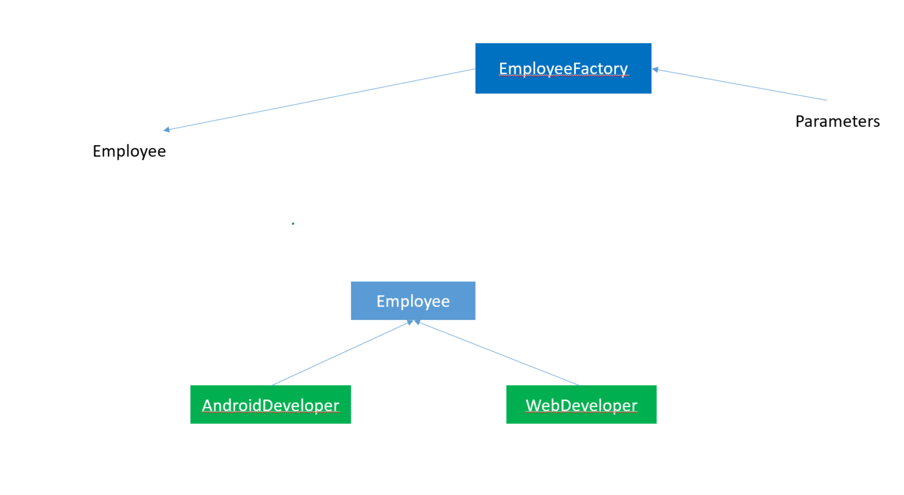
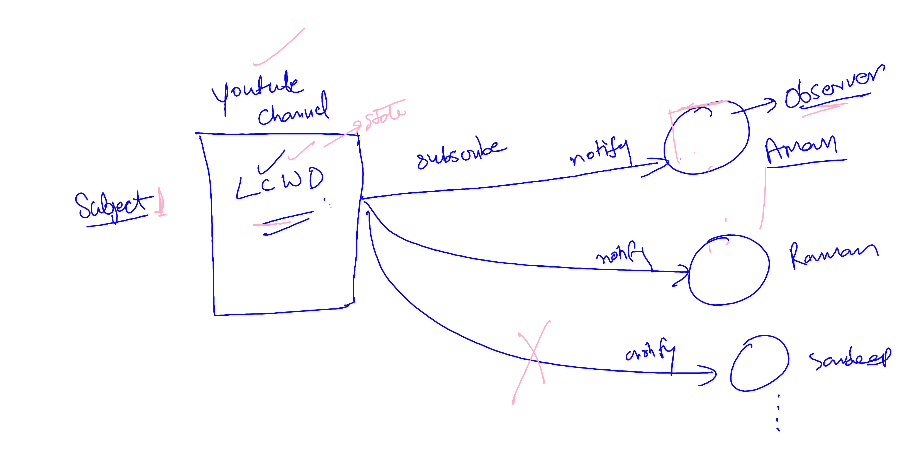

> > Use this guide with videos uploaded on youtube to get maximum out of it.

> > [Click here to watch full series](https://www.youtube.com/playlist?list=PL0zysOflRCek8kmc_jYl_6C7tpud7U2V_)

### This note is taken form code with durgesh just for learning purpose. I am not owning any of the mentioned content below.

# Singleton Design Pattern

The Singleton design pattern is a creational design pattern that restricts the instantiation of a class to a single object and provides global access to that instance throughout the application. This pattern ensures that only one instance of a class is created and provides a global point of access to it.

## Singleton Object

Singleton object are the object which are instantiated only once for project (jvm).
If we try to get the object then we get same object again and again.

### lets create singleton patter using java

Lazy way of creating singleton object

```java
class Example{


private static Example ob;

public static Example getExample(){
    if(ob==null){
        ob=new Example();
    }
    return ob;
}


}

```

### calling the singleton object

```java
class Main
{
    public static void main(String args[]){
        Example ob=Example.getExample()
        //using the object

    }

}
```

Eager way of creating Singleton object

```java
class Example{


private static Example ob=new Example();

public static Example getExample(){
      return ob;
}


}

```

Accessing object

```java

class Main
{
    public static void main(String args[]){
        Example ob=Example.getExample()
        //using the object

    }
    }
}

```

> note: for multithreaded environment we use syncronized block for creating singleton object.

```java
class Example{


private static Example ob;

public static Example getExample(){
    if(ob==null){
      syncronized(Example.class){
        if(ob==null)
        {
              ob=new Example();
        }
      }
    }
    return ob;
}


}


```

## Breaking Singleton Design Pattern

### There are three ways to break singleton design pattern . Lets talk about the these way and i am also going to tell you about the solution of these problems.

## 1. Using Reflection API

With the help of relfection api we can call private constructor as well and create multiple object by calling private constructor.

### lets see how we can call private constructor

```java

Constructor<Example> constructor=Example.class.getDeclaredConstructor()

//changing the accessibility to true
constructor.setAccessible(true)

Example example=constructor.newInstance();
```

## solution

### we can do the soultion in two ways.

1. using ENUM

```java

public enum Example{
    INSTANCE
}

```

2. check the object in private constructor if the object exists then throw exception to terminate the execution.

```java


private Exmaple(){

    if(ob!=null)
    {
        throw new RuntimeExcepiton("you are trying to break singleton pattern")
    }
}


```

## 2. Using Deserialization

when we serialze and deserialze the singleton object then singleton automatically got destroyed and provide us different object.

```java
   ObjectOutputStream oos = new ObjectOutputStream(new
        FileOutputStream("abc.ob"));
        oos.writeObject(ob);

        System.out.println("serialization done..");

        ObjectInputStream ois = new ObjectInputStream(new FileInputStream("abc.ob"));
        Example s2 = (Example) ois.readObject();
        System.out.println(s2.hashCode());


```

### solution:

just implement readResolve() method

```java
    public Object readResolve() {
        return ob;
    }

```

## 3. Using cloning

when we clone then also we get different object.

## solution

just override clone method and return the same instance.

```java

    @Override
    public Object clone() throws CloneNotSupportedException {
        return samosa;
    }

```

# Factory Design Pattern

### Factory Method Design Pattern

When there is superclass and multiple subclasses and we want to get object of subclasses based on input and requirement.

Then we create factory class which takes the responsibility of creating object of class based on input.

## Advantages of Factory Design Pattern

1. Focus on creating object for Interface rather than implementation.

2. Loose coupling, more robust code



# Abstract Factory Design Pattern

Similar to Factory Pattern

It provide the concept of Factory of Factories.


# Builder Design Pattern

while creating object when object contain may attributes
there are many problem exists :

1. we have to pass many arguments to create object.
2. some parameters might be optional
3. factory class takes all responsibility for creating object . if the object is heavy then all complexity is the part of factory class.

### So in builder pattern be create object step by step and finally return final object with desired values of attributes.

---

## Prototype Design Pattern

The concept is to copy an existing object rather than creating a new instance from scratch. because creating new object may be costly.

This approach saves costly resources and time, especially when object creation is a heavy process.

# Observer Design Pattern

- It is behavioural Design pattern.
- In this when subject changes the state all its dependent objects notified the changes.
- one to many relation.

  
